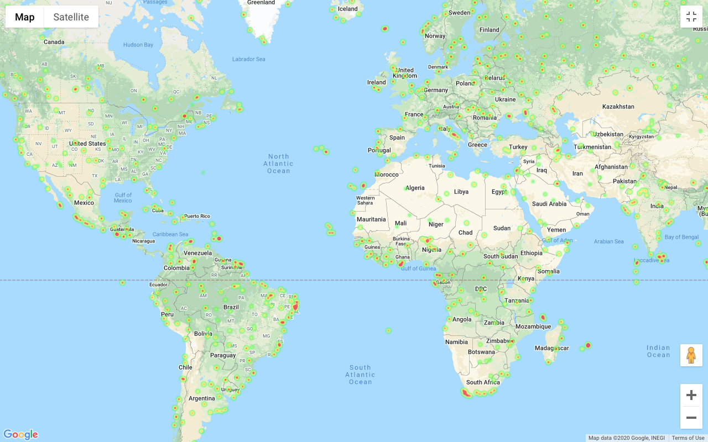
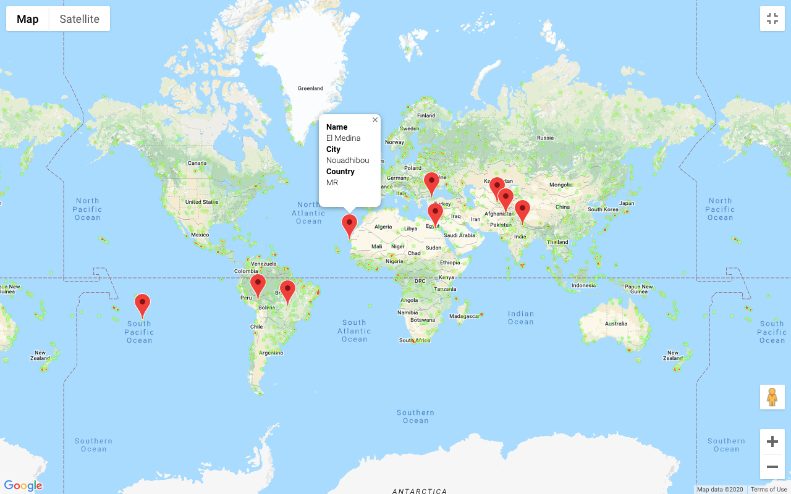

# 6 Python API Homework

## Rice University Data Analytics and Visualization Boot Camp 2020

This repository contains the following scenario:

* "What's the weather like as we approach the equator?"

## Part I - WeatherPy

In this [notebook](WeatherPy/WeatherPy.ipynb), we'll be creating a Python script to visualize the weather of 500+ cities across the world of varying distance from the equator. To accomplish this, we'll be utilizing a [simple Python library](https://pypi.python.org/pypi/citipy), the [OpenWeatherMap API](https://openweathermap.org/api).

The notebook presents a series of scatter plots to showcase the following relationships:

* [Temperature (F) vs. Latitude](/WeatherPy/data/Fig_1_Lat_vs_Temp.png)
* [Humidity (%) vs. Latitude](/WeatherPy/data/Fig_2_Lat_vs_Hum.png)
* [Cloudiness (%) vs. Latitude](/WeatherPy/data/Fig_3_Lat_vs_Cloudiness.png)
* [Wind Speed (mph) vs. Latitude](/WeatherPy/data/Fig_4_Lat_vs_Wind.png)

The notebook also presents the linear regression on each relationship separated by Northern Hemisphere (greater than or equal to 0 degrees latitude) and Southern Hemisphere (less than 0 degrees latitude):

* [Northern Hemisphere - Temperature (F) vs. Latitude](/WeatherPy/data/Fig_5_N_Latitude_Max_Temperature.png)
* [Southern Hemisphere - Temperature (F) vs. Latitude](/WeatherPy/data/Fig_6_S_Latitude_Max_Temperature.png)
* [Northern Hemisphere - Humidity (%) vs. Latitude](/WeatherPy/data/Fig_7_N_Latitude_Humidity.png)
* [Southern Hemisphere - Humidity (%) vs. Latitude](/WeatherPy/data/Fig_8_S_Latitude_Humidity.png)
* [Northern Hemisphere - Cloudiness (%) vs. Latitude](/WeatherPy/data/Fig_9_N_Latitude_Cloudiness.png)
* [Southern Hemisphere - Cloudiness (%) vs. Latitude](/WeatherPy/data/Fig_10_S_Latitude_Cloudiness.png)
* [Northern Hemisphere - Wind Speed (mph) vs. Latitude](/WeatherPy/data/Fig_11_N_Latitude_Wind_Speed.png)
* [Southern Hemisphere - Wind Speed (mph) vs. Latitude](/WeatherPy/data/Fig_12_S_Latitude_Wind_Speed.png)

The final [notebook](WeatherPy/WeatherPy.ipynb) has the following features:

* Randomly select **N** unique (non-repeat) cities based on latitude and longitude.
* Perform a weather check on each of the cities using a series of successive API calls.
* Include a print log of each city as it's being processed with the city number and city name.
* Save a CSV of all retrieved data and a PNG image for each scatter plot.

### Part II - VacationPy

In this [notebook](VacationPy/VacationPy.ipynb), the skills used to working with weather data will be useful to plan future vacations. Use jupyter-gmaps and the Google Places API for this part of the assignment.

* **Note:** Remember that any API usage beyond the $200 credit will be charged to your personal account. You can set quotas and limits to your daily requests to be sure you can't be charged. Check out [Google Maps Platform Billing](https://developers.google.com/maps/billing/gmp-billing#monitor-and-restrict-consumption) and [Manage your cost of use](https://developers.google.com/maps/documentation/javascript/usage-and-billing#set-caps) for more information.

* **Note:** if you having trouble displaying the maps try running `jupyter nbextension enable --py gmaps` in your environment and retry.

* Create a heat map that displays the humidity for every city from the part I of the homework.

  

* Narrow down the DataFrame to find your ideal weather condition. For example:

  * 1-A max temperature lower than 80 degrees but higher than 70.

  * 2-Wind speed less than 10 mph.

  * 3-Zero cloudiness.

  * Drop any rows that don't contain all three conditions. You want to be sure the weather is ideal.

  * Based on the 3 previous specifications, we limit the number of rows returned by the API to 10 values.

* Using Google Places API to find the first hotel for each city located within 5000 meters of your coordinates.

* Plot the hotels on top of the humidity heatmap with each pin containing the **Hotel Name**, **City**, and **Country**.

  
